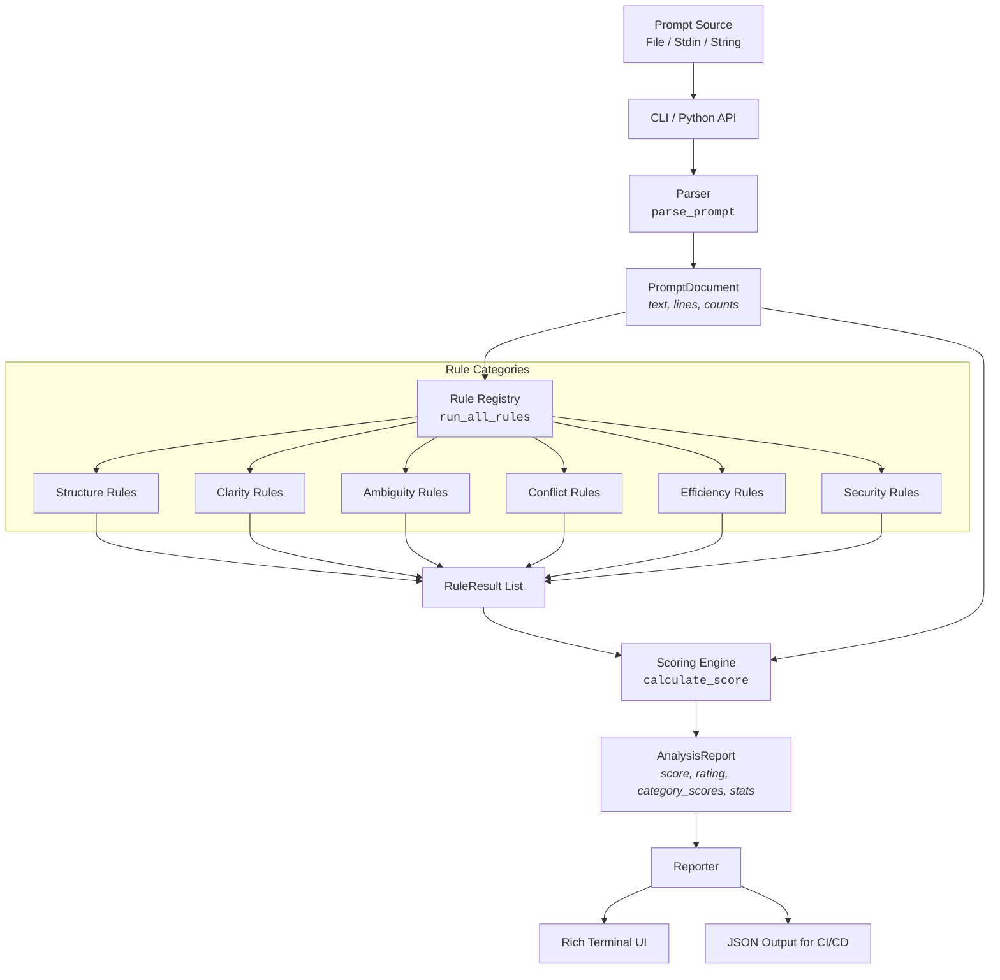

# Architecture Guide

This document outlines the architecture, data flow, module breakdown, and extensibility points of PromptLint.

---

## Design Principles

PromptLint is built with the following core engineering principles:

1. **Zero External Calls (100% Offline):** Analysis, security scanning, and rule evaluation run entirely locally. Prompts are never transmitted over the network.
2. **Deterministic Static Analysis:** Rules use heuristic pattern matching and structural parsing, not non-deterministic LLMs. Results are repeatable, fast (<10ms), and predictable.
3. **Decoupled Architecture:** Core data models are completely isolated from CLI rendering, rule logic, and file I/O.
4. **Actionable Diagnostics:** Every lint finding is accompanied by a concrete, context-aware suggestion to guide prompt engineering improvements.

---

## Data Flow Architecture

The data pipeline processes prompts through five distinct phases:



### Pipeline Execution Steps

1. **Ingestion:** Raw prompt text is ingested via the Typer CLI (`promptlint analyze <file>`), standard input (`-`), or directly via the Python API (`promptlint.analyze(...)`).
2. **Parsing (`parse_prompt`):** The parser constructs a `PromptDocument`, pre-computing metrics such as word count, line count, character count, and line splits.
3. **Rule Execution (`run_all_rules`):** The `analyzer` orchestrator passes the `PromptDocument` to registered rule categories. Each rule inspects the document and returns zero or more `RuleResult` instances.
4. **Scoring (`calculate_score`):** The scoring engine computes the overall quality score (0–100), per-category scores, human-readable rating, and token estimation statistics.
5. **Report Generation (`AnalysisReport`):** The analyzer packages rule results, scores, statistics, and security summaries into a unified `AnalysisReport`.
6. **Reporting (`reporter`):** The reporter formats the report into rich, styled terminal tables or machine-readable JSON for CI/CD pipelines.

---

## Module Responsibilities

The codebase follows a standard `src`-layout under `src/promptlint/`:

| Module | Responsibility |
| :--- | :--- |
| **`models.py`** | Shared data structures (`RuleResult`, `PromptDocument`, `AnalysisReport`, `CategoryScore`, `SecurityStatus`, `PromptStatistics`, `Severity`). Acts as the shared vocabulary of the system. |
| **`parser.py`** | Transforms raw text into `PromptDocument` and handles edge cases (empty strings, whitespace-only input). |
| **`analyzer.py`** | Pipeline orchestrator. Coordinates parsing, rule execution, scoring, and report assembly. |
| **`scoring.py`** | Scoring engine. Calculates base deductions, per-category scores, rating tiers, and token counts. |
| **`reporter.py`** | Presentation layer. Separate, isolated rendering paths for Rich terminal formatting and JSON serialization. |
| **`security.py`** | Core offline pattern scanner for credential leak detection and adversarial prompt injection patterns. |
| **`diff.py`** | Compares two prompts, evaluating score deltas, category regressions, and diagnostic changes. |
| **`fixer.py`** | Deterministic rule-based prompt structure enhancer (adds missing task headers, format sections, and normalizes whitespace). |
| **`config.py`** | Hierarchical configuration loader (`.promptlintrc.toml`). Allows disabling rules and overriding severities. |
| **`testing.py`** | Prompt testing framework supporting YAML test specifications and model adapters. |
| **`cli.py`** | Command-line interface built with Typer. Handles arguments, flags, standard input, and exit codes. |
| **`rules/`** | Rule implementations grouped cleanly by category. |

---

## How to Add a New Rule

Adding a new rule to PromptLint is straightforward and does not require changes to the core data models.

### Step 1: Choose or Create a Category

Navigate to `src/promptlint/rules/` and locate the category file matching your rule:
- `structure.py` for document structure and organization.
- `clarity.py` for precision, definitions, and pronoun clarity.
- `ambiguity.py` for vague quantities and subjective criteria.
- `conflicts.py` for contradictory instructions.
- `efficiency.py` for redundancy, whitespace, and prompt length.
- `security.py` for security, secrets, and injection vulnerabilities.

### Step 2: Implement the Rule Function

Write a focused rule function that accepts a `PromptDocument` and returns `list[RuleResult]`.

```python
import re
from promptlint.models import PromptDocument, RuleResult, Severity

def check_avoid_negative_constraints(doc: PromptDocument) -> list[RuleResult]:
    """CLAR004: Flag excessive negative constraints ('don't do X')."""
    results: list[RuleResult] = []
    
    negative_pattern = re.compile(r"\b(do not|don't|never|cannot)\b", re.IGNORECASE)
    
    for i, line in enumerate(doc.lines, start=1):
        matches = list(negative_pattern.finditer(line))
        if len(matches) >= 3:
            results.append(
                RuleResult(
                    rule_id="CLAR004",
                    category="clarity",
                    severity=Severity.WARNING,
                    message="Line contains excessive negative constraints.",
                    suggestion="Rephrase negative constraints positively (e.g., state what the model SHOULD do).",
                    score_impact=-5,
                    line=i,
                )
            )
            
    return results
```

### Step 3: Register in the Category Analyzer

Add your rule function to the `analyze_<category>()` dispatcher in `src/promptlint/rules/<category>.py`:

```python
def analyze_clarity(document: PromptDocument) -> list[RuleResult]:
    results: list[RuleResult] = []
    results.extend(check_vague_instructions(document))
    results.extend(check_undefined_terminology(document))
    results.extend(check_ambiguous_references(document))
    results.extend(check_avoid_negative_constraints(document))  # <-- Added
    return results
```

### Step 4: Write Unit Tests

Create test cases in `tests/test_rules_<category>.py` verifying both positive triggers and negative passes:

```python
from promptlint.parser import parse_prompt
from promptlint.rules.clarity import check_avoid_negative_constraints

def test_clar004_triggers_on_excessive_negatives():
    doc = parse_prompt("Don't write prose, never use markdown, and do not summarize.")
    results = check_avoid_negative_constraints(doc)
    assert len(results) == 1
    assert results[0].rule_id == "CLAR004"

def test_clar004_passes_on_positive_instructions():
    doc = parse_prompt("Write concise output in markdown bullet points.")
    results = check_avoid_negative_constraints(doc)
    assert len(results) == 0
```

### Step 5: Update Rule Documentation

Add the rule ID, description, example trigger, and example suggestion to `docs/rules.md`.
